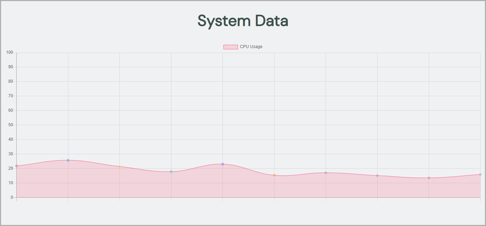

<h1>This is a PWA developed for GSoC, project proposal.</h1>
The App is Hosted <a href="https://himanshu9271.github.io/Diagnostics-PWA/">Here</a>. It can also be installed by clicking install icon whcich appears on the address bar of the browser.
  As of now the system-data page is configured to show a CPU utilization chart, which shows the average utilization of all the cores in your cpu. I have tested it on my machine which have 2 cores and 2 threads.  
  
[Screenshots]

 
<h2>Requirements</h2>
The only requirement is to Download the "Chrome-extention" file from the repo and add it to your browser as a Chrome extention, and then open the link and visit system-data. Then you will be able to see the CPU utilization chart.
